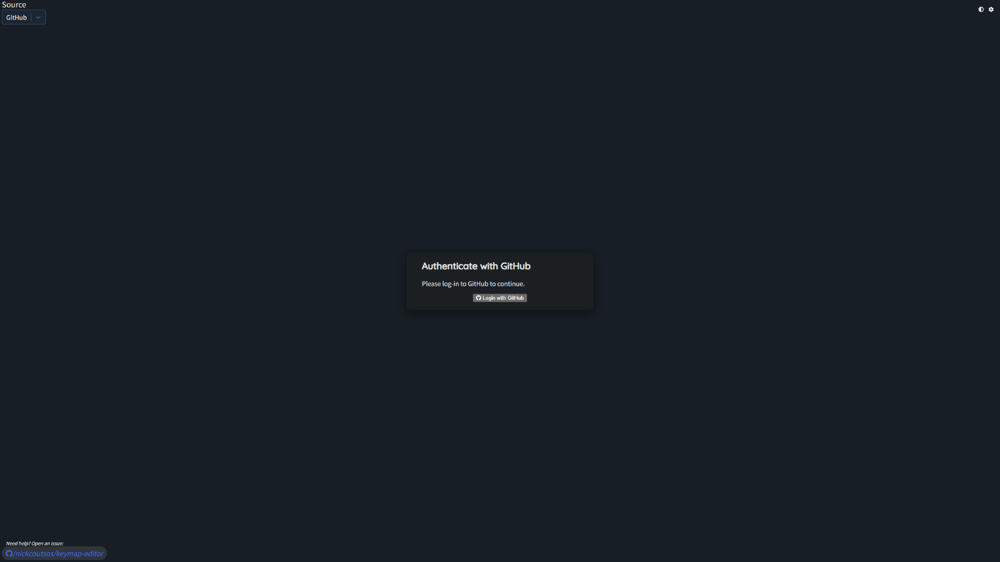

# User manual for Cocon

## 目次

- [User manual for Cocon](#user-manual-for-cocon)
  - [目次](#目次)
  - [電源の入れ方](#電源の入れ方)
  - [デフォルトキーマップ](#デフォルトキーマップ)
  - [キーマップ変更方法](#キーマップ変更方法)
  - [ファームウェアインストール](#ファームウェアインストール)
  - [充電](#充電)
  - [トラブルシューティング](#トラブルシューティング)

## 電源の入れ方

本体の横側にあるスイッチを手前側にスライドしてください。  
※組立時にバッテリーを搭載していない場合、スライドスイッチの操作は必要ありません。USBを接続することで使用できます。  

## デフォルトキーマップ

デフォルトでは下記のキーマップになっています。

Default Layer

Layer1（Function Layer）

Layer2（Number Arrow  Layer）

Layer3（Mouse Layer）

Layer4（Scroll Number Layer）

Layer5（Bluetooth Layer）

> [!TIP]
> Default Layerの「Shift」と「‐」を同時押しすることで入れます。

## キーマップ変更方法

1. 下記のリポジトリをフォークする。  
    [Cocon-zmk-config](https://github.com/waressyoi/Cocon-zmk-config.git)
1. フォーク後Keymap Editorにアクセス  
    [Keymap Editor](https://nickcoutsos.github.io/keymap-editor/)
1. 中央のGithubをクリック
    
1. 「Login with GitHub」をクリック
    
1. 「Authorize Keymap Editor」を選択  
    指示に従いCocon-zmk-configにアクセスできるようにする。
1. アクセスできるようになると下記の画像のようにキーマップが表示されます。

1. 変更したいキーをクリックすることで好きにキーマップを変更できます。
1. キーマップの変更が完了したら左上の「Save」をクリックしてください。
1. GitHub Actionsで自動的にファームウェアがビルドされます。
1. ビルドが完了するとと「Firmware.zip」がダウンロードできます。
    

## ファームウェアインストール

1. PCとUSBで接続する。
1. 赤丸で囲っている部分から細い棒を入れてXiao BLEのリセットボタンを2回押してください。

    

1. 対応したFirmwareファイルを「XIAO-SENSE」にドラッグアンドドロップする。  
    右手側：Cocon_R rgbled_adapter-seeeduino_xiao_ble-zmk.uf2  
    左手側：Cocon_L rgbled_adapter-seeeduino_xiao_ble-zmk.uf2

    

## 充電

組み立ての際にバッテリーを搭載した場合はUSBから充電できます。  
充電の際は本体横のスイッチをON（手前側）にしてください。  
Coconを充電する際は必ず目の届く場所で充電してください。

バッテリー残量は電源をつけた際のインジケータで確認できます。

| バッテリー残量     | LED色           | 状態         |
| :----------------- | :-------------- | :----------- |
| **80%** より上     | **緑 (Green)**  | 点灯         |
| **20%** ～ **80%** | **黄 (Yellow)** | 点灯         |
| **20%** 未満       | **赤 (Red)**    | 点灯         |
| **5%** 未満        | **赤 (Red)**    | 定期的に点滅 |

## トラブルシューティング

Windowsと接続した際にトラックボールの反応が悪い場合は下記の設定を行ってください。

1. デバイスマネージャーを開く
1. 「Cocon」を選択した状態で「表示」をクリックして表示順を「デバイス（接続別）」に変更してください。  
      
    
1. 「Cocon」が接続しているデバイスのプロパティを開きます
    「電源の節約のために、コンピューターでこのデバイスの電源をオフにできるようにする(A)」のチェックを外す
    
1. Microsoft Bluetooth LE Enumerator」→「RZ717 Bluetooth(R) Adapter」・・・のように接続しているデバイスすべての設定を変更してください。
